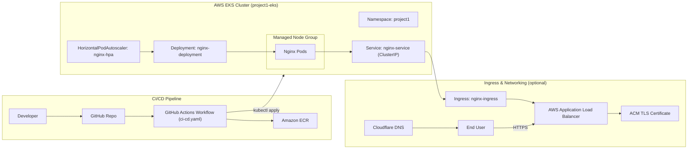

# Project 1 — CI/CD to Amazon EKS with GitHub Actions

This project implements an end-to-end CI/CD pipeline that builds, tags, and deploys a containerized Nginx application to an Amazon EKS cluster using GitHub Actions.

A push to the `main` branch triggers a workflow that builds a Docker image, tags it with the Git commit SHA, pushes it to Amazon ECR, updates the Kubernetes Deployment manifest, and applies the manifests to a dedicated namespace in EKS. The pipeline waits for a successful rollout and runs an HTTPS smoke test when the Ingress is enabled.

This repository serves as a foundational project for building and understanding production-style Kubernetes delivery workflows on AWS.

---

## Architecture Overview

The pipeline integrates GitHub Actions with an Amazon EKS cluster running on a managed node group. Application images are built by the GitHub Actions pipeline and stored in Amazon ECR, then deployed into a dedicated Kubernetes namespace.

When enabled, external traffic enters through an AWS Application Load Balancer created by the Kubernetes Ingress. TLS is terminated using an ACM certificate, and requests are routed to the Nginx Service running inside the cluster.



---

## Key Features

- GitHub Actions pipeline triggered by pushes to `main`
- Docker image built from application source and tagged with commit SHA
- Images stored in Amazon ECR for versioned deployments
- Kubernetes Deployment in a dedicated namespace for isolation
- Horizontal Pod Autoscaler for CPU-based scaling
- Optional ALB-backed Ingress with HTTPS via ACM
- HTTPS smoke test executed after successful rollout
- Infrastructure created using `eksctl` with a managed node group

---

## Repository Structure

```text
.
├── app/
│   ├── Dockerfile
│   └── index.html
│
├── k8s/
│   ├── deployment.yaml
│   ├── service.yaml
│   ├── hpa.yaml
│   └── ingress.yaml
│
└── .github/
    └── workflows/
        └── ci-cd.yaml
```

- `app/` contains the Dockerfile and application content served by Nginx
- `k8s/` contains Kubernetes manifests deployed to the EKS cluster
- `.github/workflows/` contains the GitHub Actions CI/CD pipeline

---

## CI/CD Pipeline Flow

1. A push to the `main` branch triggers the GitHub Actions workflow
2. The Docker image is built from the `app/` directory
3. The image is tagged using the Git commit SHA
4. The image is pushed to Amazon ECR
5. The Deployment manifest image reference is updated
6. Kubernetes manifests are applied to the target namespace
7. The rollout is monitored until completion
8. An HTTPS smoke test validates external access when Ingress is enabled

---

## Kubernetes Deployment

The application is deployed into the `project1` namespace and consists of:

- **Deployment (`nginx-deployment`)**  
  Manages application replicas and rolling updates using immutable image tags

- **Service (`nginx-service`)**  
  ClusterIP service providing stable internal access to pods

- **Horizontal Pod Autoscaler (`nginx-hpa`)**  
  Scales replicas based on CPU utilization

- **Ingress (`nginx-ingress`)** *(optional)*  
  Provisions an AWS Application Load Balancer and enables HTTPS access

---

## AWS Infrastructure

- **Amazon EKS** – Managed Kubernetes control plane
- **Managed Node Group (EC2)** – Runs application workloads
- **Amazon ECR** – Stores versioned container images
- **AWS Application Load Balancer** – Handles external traffic
- **AWS Certificate Manager** – Manages TLS certificates
- **Cloudflare DNS** – Routes public traffic to the ALB

---

## Deployment Notes

The following steps describe how this environment was created during development.  
They are provided for reference and reproducibility.

1. Create the EKS cluster and node group using `eksctl`
2. Create the application namespace
3. Create an ECR repository for container images
4. Push application and Kubernetes manifests to GitHub
5. Allow the CI/CD pipeline to build and deploy automatically
6. Apply the Ingress manifest when public HTTPS access is required

Ingress can be removed at any time to eliminate external exposure and ALB costs.

> Note: EKS cluster creation is documented separately in `docs/platform-notes.md`.